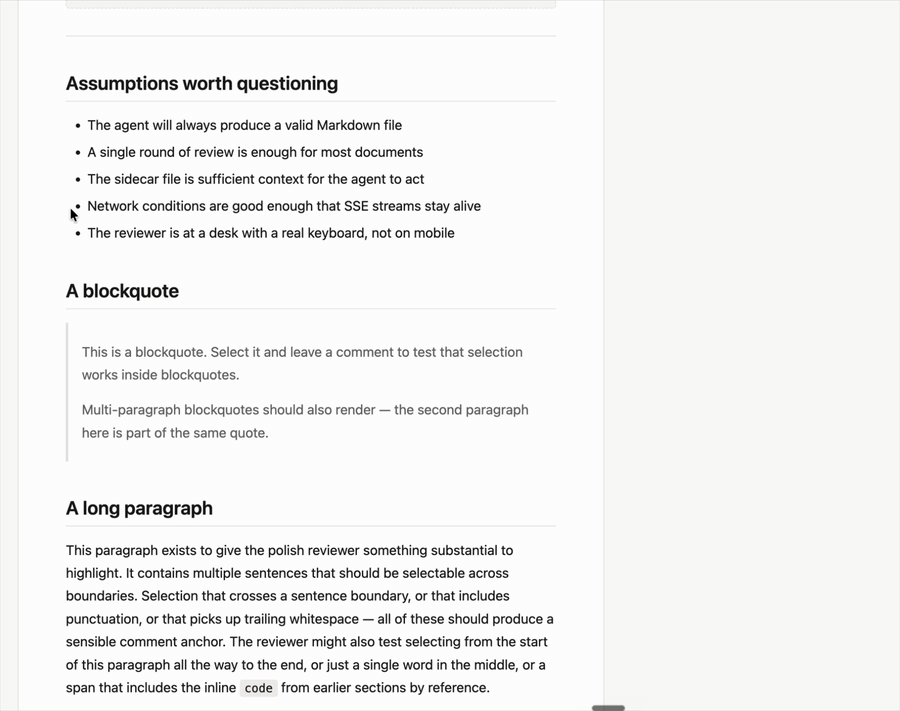

# Redline

**Inline comments on Markdown files, designed for human-in-the-loop AI doc review.**

Open a Markdown file, highlight text, leave inline comments, discuss changes with Claude, and apply accepted revisions back to the document.



## Try it in 30 seconds

```sh
bunx @levistudio/redline ./spec.md
```

(or `npx @levistudio/redline ./spec.md` — Bun is required either way.)

The terminal prints a `localhost` URL. Cmd-click it. Select any text in the document, type a comment, hit reply. Claude responds in the thread within ~2s. Resolve each comment, then click **Revise document** to have Claude apply the agreed edits back to the file on disk.

Requires [Bun](https://bun.sh) ≥ 1.0 and an authenticated [Claude Code](https://claude.com/claude-code) session. The agent inherits your existing Claude Code OAuth — no `ANTHROPIC_API_KEY` needed.

## Why Redline exists

A lot of recent docs start as a Claude draft. Reviewing those drafts in a chat window is awkward. Comments scroll out from under the text. "Fix paragraph 3" loses its anchor as soon as the doc is rewritten. Google-Docs-style tools don't speak the file on disk.

Redline puts an inline-comment layer on top of a local Markdown file, with a Claude agent participating in the review thread. Comments are anchored to the text they're about. The conversation is real-time. Accepted changes are applied back to the file you started with, no copy-paste.

## Who it's for

People shipping docs with the help of AI agents:

- Engineers reviewing **AI-generated PRDs and architecture specs** before they go to a team.
- PMs and tech leads reviewing **Claude Code / Codex / Cursor output** before merging.
- Tech writers running a **human-in-the-loop AI doc review** on README drafts.
- Anyone who wants **inline comments on Markdown** without uploading the file to a SaaS.

## How it works

Two long-lived processes:

- **Server** ([src/server.ts](src/server.ts)) — renders Markdown, serves the review UI, accepts comment / reply / resolve POSTs, broadcasts SSE events.
- **Agent** ([src/agent.ts](src/agent.ts)) — child process listening to the SSE stream. Calls `claude -p` to compose replies and post them back. When you accept a round, the agent runs the document revision pass and writes the result to disk.

Review state lives in a sidecar JSON file at `.review/<filename>.json` next to the doc. History snapshots of every revision land in `.review/history/<filename>.<iso>.md` *before* the revision is written, so you can roll back from disk if a revision goes sideways. Both should be gitignored unless you want them in the repo.

After each revision, the new round opens with the document rendered inline as a diff against the previous round — insert and delete bands at the block level, word-level marks within modified paragraphs — so you can read the agent's changes in place. Use the **Show changes** / **Hide changes** toggle in the header to flip back to the clean view at any time. From there you either open another round of comments or click **Looks good** to finish.

[CLAUDE.md](CLAUDE.md) has the full architecture tour: sidecar schema, SSE event vocabulary, model picking, frontend gotchas.

## Use cases

- **Reviewing AI-generated PRDs.** Hand Claude Code a one-line brief, let it draft the PRD, then redline it line by line before passing it on.
- **Reviewing architecture specs.** Mark assumptions you want challenged, ask the agent to expand sections, ship the revised spec.
- **Reviewing README drafts.** Claude wrote your README — read through, leave inline comments where the framing is off, accept the revision in one click.
- **Approving Claude Code output before merge.** Use the bundled [redline-review skill](skills/redline-review/SKILL.md) so your outer agent automatically hands you the doc to sign off on.
- **Human approval loops for agent-written docs.** Anywhere an agent needs your sign-off on prose before continuing, run it through Redline.

## Reviewing for a specific lens

Pass `--context` at startup to tell Claude what you're focused on for the review. The context is shown in a banner above the doc and threaded into both the reply and revision prompts, so the agent can weight its responses accordingly.

```sh
bunx @levistudio/redline ./spec.md --context "Reviewing for technical accuracy, not prose style."
bunx @levistudio/redline ./api-rfc.md --context "Looking for missing security considerations and breaking changes."
```

The context is persisted in the sidecar on first run, so it carries across rounds and is available the next time you reopen the same review.

## Manual annotation (no agent)

If you just want inline comments on a Markdown file without a Claude conversation, pass `--no-agent`:

```sh
bunx @levistudio/redline ./spec.md --no-agent
```

The server still runs, you can still leave comments and resolve them, but no agent process is spawned and no `claude` binary is required on your PATH. The header shows a "Manual mode" pill so the absence of replies is intentional, not broken. Useful for:

- Annotating a doc you don't want sent to Claude
- Trying Redline before configuring Claude Code
- Quick inline-comment passes where you don't want a revision step

## One-shot revision

If you already have a sidecar with resolved comments and just want to apply the revision without the live UI:

```sh
bunx @levistudio/redline resolve ./spec.md
bunx @levistudio/redline resolve ./spec.md --model claude-sonnet-4-6
```

## Outer-agent handoff (optional)

Want your AI coding agent (Claude Code etc.) to invoke Redline automatically whenever it produces a Markdown doc you need to sign off on? Install the bundled skill:

```sh
git clone https://github.com/alevi/redline.git && cd redline
./scripts/install-skill.sh
```

This copies `skills/redline-review/` into `~/.claude/skills/` with absolute paths baked in. After installation, your outer agent will reach for `redline-review` whenever it has Markdown that needs human review before it can continue.

## Local-first / security

- Single-player. Server binds to `127.0.0.1`. No auth, no audit log, no cloud.
- Rendered Markdown is sanitized at the render boundary; raw HTML, inline event handlers, and `javascript:` URLs are stripped before the document reaches the browser.
- The agent inherits your existing Claude Code OAuth session; no `ANTHROPIC_API_KEY` required.
- **Prompt injection in document content is not defended against.** Run Redline on docs you trust.

Full threat model: [SECURITY.md](SECURITY.md).

## Known limitations

- Markdown only. PDFs, Word docs, raw HTML — out of scope.
- Single-player. No multi-reviewer mode, no auth, no comment-permalink sharing.
- Single file per session. No folder mode or repo-wide review.
- Concurrent `redline` processes on the same `.md` can corrupt the sidecar.
- Bun required at runtime — there's no plain-Node mode.

## Develop locally

```sh
git clone https://github.com/alevi/redline.git
cd redline
bun install
bun link            # exposes `redline` on PATH
redline ./sample.md
bun test
```

## License

[MIT](LICENSE).
